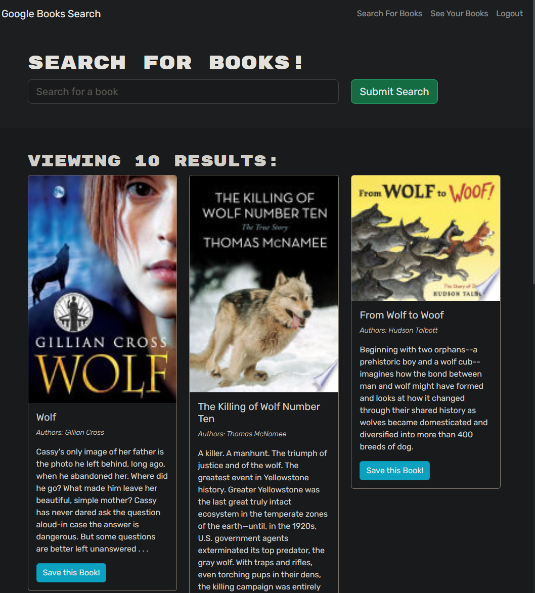

# 21 MERN: Book Search Engine

Welcome to the 21 MERN Book Search Engine! 
 
This application allows users to search for books using the Google Books API and save their favorite books to their account. 
 
It is built with the MERN stack, which includes MongoDB, Express.js, React, and Node.js. 
 
The back end of the application has been refactored to use GraphQL API with Apollo Server.

**PSA: If you just think about the book "Think and Grow Rich", it will automatically search it for you through manifestation.**
 
*"if you can conceive it and believe it, you can achieve it" - Napoleon Hill*

Try it out here: 
[Deployed Link on Heroku](https://book-search-0610.herokuapp.com/)

 
 

## Table of Contents
- [Installation](#installation)
- [Usage](#usage)
- [Technologies](#technologies)
- [Contributing](#contributing)
- [License](#license)
- [Questions](#questions)

## Installation

To run the Book Search Engine locally on your machine, follow these steps:

1. Clone the repository to your local machine.
2. Navigate to the project directory using the command prompt or terminal.
3. Run the following command to install the required dependencies: npm i
4. Create a `.env` file in the root directory and provide the necessary environment variables. Refer to the `.env.EXAMPLE` file for the required variables.
5. Start the application by running the following command: npm start
6. Access the application in your web browser at `http://localhost:3000`.

## Usage

- As an avid reader, you can use the Book Search Engine to discover new books to read and keep a list of books to purchase.
- To search for books, enter a search term in the input field and click the "Search" button. You will be presented with search results containing book titles, authors, descriptions, images, and links to the Google Books site.
- If you are not logged in, you can still perform searches, view search results, and see book details.
- To save a book to your account, click the "Save" button on a book card. If you're not logged in, you will be prompted to log in or sign up.
- When logged in, you can view your saved books by clicking the "Saved Books" link in the navigation menu. Here you will see a list of your saved books with their details.
- To remove a book from your saved list, click the "Remove" button on the respective book card.
- You can also log out of your account by clicking the "Logout" button.

## Technologies

This project utilizes the following technologies:

- MongoDB: A NoSQL database used for storing user accounts and saved books.
- Express.js: A web application framework for building the server-side API.
- React: A JavaScript library for building the user interface.
- Node.js: A JavaScript runtime environment for running server-side JavaScript code.
- GraphQL: A query language for APIs used to define the data structure and fetch data efficiently.
- Apollo Server: An open-source, GraphQL-specific server that works with any GraphQL schema.
- Axios: A promise-based HTTP client used for making API requests to the Google Books API.
- JSON Web Tokens (JWT): A compact URL-safe means of representing claims between two parties.
- bcrypt: A password-hashing function used for securely storing user passwords.
- Heroku: A cloud platform for deploying and hosting the application.
- MongoDB Atlas: A cloud database service used for hosting the MongoDB database.

## Contributing

Contributions to the Book Search Engine project are welcome! If you would like to contribute, please follow these steps:

1. Fork the repository.
2. Create a new branch for your feature or enhancement.
3. Make the necessary changes and commit them.
4. Push your changes to your fork.
5. Submit a pull request detailing the changes you made.

## License

This project is licensed under the [MIT License](LICENSE).

## Questions

If you have any questions, please feel free reach out on LinkedIn

## Screenshots

